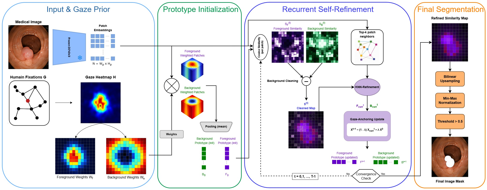
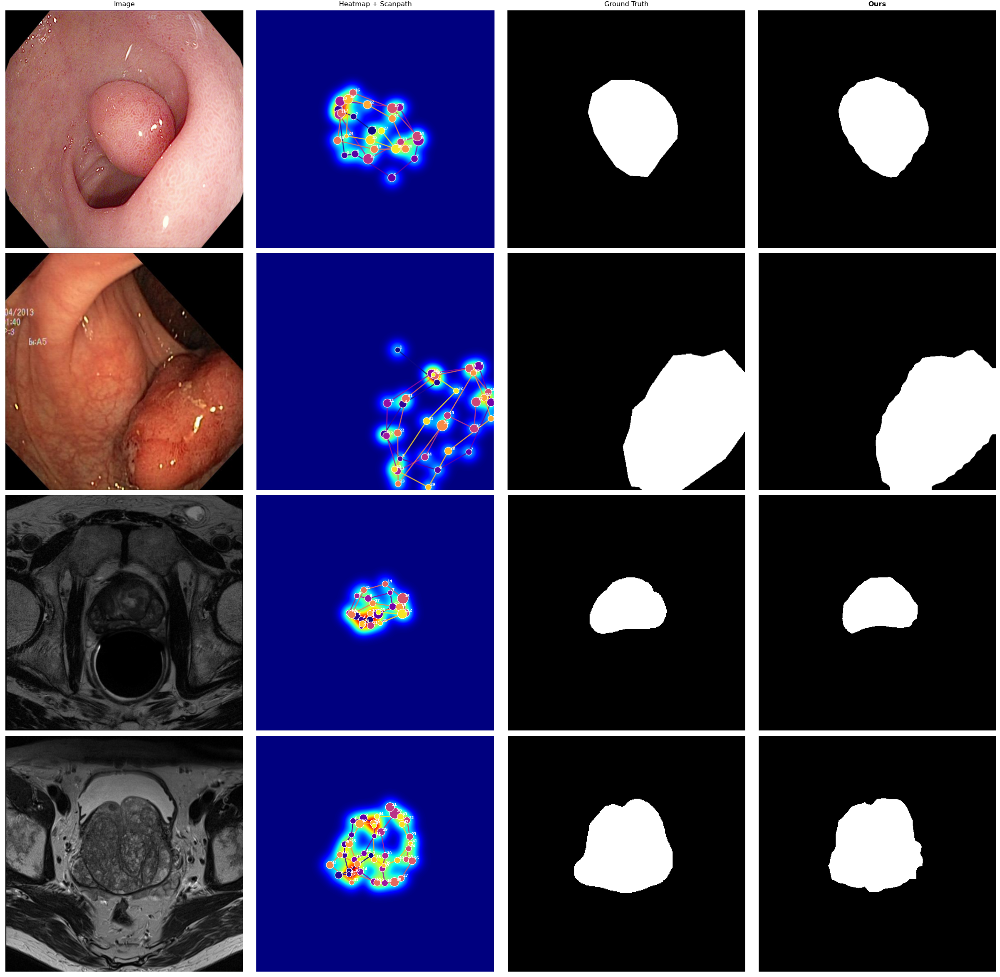
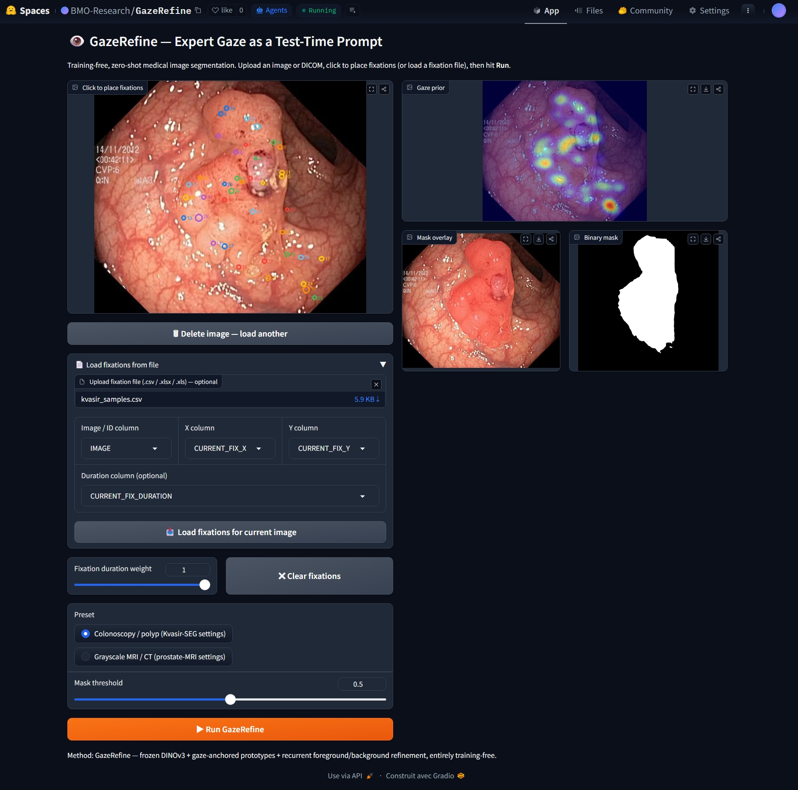

# GazeRefine 👁️

## Expert Gaze as a Test-Time Prompt for Training-Free Medical Image Segmentation

[](https://www.python.org/)
[](https://pytorch.org/)
[](https://github.com/huggingface/pytorch-image-models)
[](LICENSE)
[](https://huggingface.co/spaces/anonymous-IA/GazeRefine)
[](https://arxiv.org/abs/XXXX.XXXXX)

GazeRefine is a **training-free** and **zero-shot** medical image segmentation
framework that uses **expert gaze** as an inference-time prompt to guide frozen
DINOv3 representations.

Instead of segmentation masks, clicks, boxes, adapters, prompt encoders, or
fine-tuning, GazeRefine transforms eye-tracking scanpaths into gaze-guided
semantic prototypes and iteratively refines them in the frozen DINOv3 feature
space.

> No training. No fine-tuning. No segmentation foundation model.  
> Just expert gaze + frozen DINOv3 features.

---

## Overview

Medical image segmentation often requires dense expert annotations and
task-specific training. GazeRefine explores a different paradigm: using the
natural visual attention of clinicians to steer a frozen vision foundation
model directly at test time.

### Key Features
<p>✅ <b>Training-free</b>  No model weights are updated, ever </p> 
<p>✅ <b>Zero-shot</b>  Works on any anatomy / modality without labelled data </p>
<p>✅ <b>Human-in-the-loop</b>  Expert gaze replaces dense manual annotation </p>
<p>✅ <b>Frozen DINOv3</b>  Exploits emergent localization in self-supervised ViTs </p>  
<p>✅ <b>No SAM / MedSAM</b>  No segmentation foundation model dependency </p>
<p>✅ <b>No adapters</b>  No prompt encoders, no fine-tuned parameters </p>

---

## Pipeline

<p align="center">
  
</p>

<p align="center">
<b>Figure 1.</b> Overview of the GazeRefine pipeline. Expert scanpaths are converted
into duration-weighted gaze priors that initialize foreground and background
prototypes in the frozen DINOv3 feature space. Prototypes are refined through
recurrent contrastive cleaning and kNN affinity propagation to produce the final
segmentation mask — entirely training-free.
</p>

---

## Results

<p align="center">
  
</p>

<p align="center">
<b>Figure 2.</b> Example segmentation results on Kvasir-SEG and NCI-ISBI prostate MRI datasets. GazeRefine accurately recovers target structures from sparse gaze information while remaining fully training-free.
</p>

GazeRefine produces more complete object delineation while remaining fully
training-free and operating directly on frozen DINOv3 features.

---  
<p align="center">
  
| Method | Supervision | Kvasir-SEG Dice (%) ↑ | NCI-ISBI Dice (%) ↑ |
|---|---|:---:|:---:|
| **GazeRefine** | **Zero-Shot + Gaze** | **89.49 ± 0.12** | 76.53 ± 0.17 |


</p>
These results demonstrate that expert gaze can provide a powerful test-time supervisory signal for segmentation without requiring any annotated masks or parameter updates.

---

## Installation

```bash
git clone https://github.com/MohammedOussamaBEN/GazeRefine.git
cd GazeRefine
pip install -r requirements.txt
```

**Requirements:** Python ≥ 3.10 · PyTorch ≥ 2.1 · timm ≥ 1.0.  
`pydicom` is only needed if you use the prostate-MRI (DICOM) dataset loader.

---

## Quick Start

### Command-line (single image)

```bash
python scripts/predict_single.py \
    --image examples/images/cju0roawvklrq0799vmjorwfv.jpg \
    --fixations examples/fixations/kvasir_samples.csv \
    --output outputs/output_mask.png \
    --preset colonoscopy
```

Add `--save_overlay` to also save a colour overlay (`output_mask_overlay.png`) and a gaze-prior PNG (`output_mask_gaze.png`) next to the mask:

```bash
python scripts/predict_single.py \
    --image examples/images/cju0roawvklrq0799vmjorwfv.jpg \
    --fixations examples/fixations/kvasir_samples.csv \
    --output outputs/output_mask.png \
    --preset colonoscopy \
    --save_overlay
```

For **prostate MRI** (low-contrast grayscale), use the `--preset mri` flag:

```bash
python scripts/predict_single.py \
    --image examples/images/Prostate3T-01-0001_13.dcm \
    --fixations examples/fixations/nci-isbi_samples.csv \
    --output outputs/output_mask2.png \
    --preset mri \
    --save_overlay
```

### Python API

```python
from scripts.predict_single import predict

# Returns a PIL Image of the binary mask
mask = predict(
    image_path="examples/images/cju0roawvklrq0799vmjorwfv.jpg",
    fixation_csv="examples/fixations/kvasir_samples.csv",
)
mask.save("output_mask.png")

# Extended: also get colour overlays and raw numpy arrays
result = predict(
    image_path="examples/images/cju0roawvklrq0799vmjorwfv.jpg",
    fixation_csv="examples/fixations/kvasir_samples.csv",
    preset="colonoscopy",   # "colonoscopy" (default) | "mri"
    threshold=0.5,
    return_all=True,
)
result["mask"].save("mask.png")
result["gaze_overlay"].save("gaze.png")
result["mask_overlay"].save("overlay.png")
```

`image_path` also accepts an already-loaded `PIL.Image` object — useful when
calling `predict` from a Gradio Space or a notebook loop without hitting disk.

### Fixation CSV format

```csv
x,y,duration
340,221,180
356,228,145
368,244,205
```

| Column | Meaning |
|---|---|
| `x`, `y` | Fixation position in **raw pixel coordinates** of the input image |
| `duration` | Fixation duration in any consistent unit (ms typical) |

`x` and `y` are automatically normalized inside the model by the image size.
Only *relative* durations matter — the model min-max normalizes them
internally. See `examples/` for ready-to-run example CSVs.

### CLI flags reference

| Flag | Default | Description |
|---|---|---|
| `--image` | *(required)* | Path to the input image (`.jpg` / `.jpeg` / `.png` / `.dcm`) |
| `--fixations` | *(required)* | Path to the fixation CSV (`x,y,duration` — pixel coordinates) |
| `--output` | *(required)* | Where to save the predicted binary mask (`.png`) |
| `--preset` | `colonoscopy` | Hyperparameter preset: `colonoscopy` or `mri` |
| `--threshold` | `0.5` | Binarization threshold applied to the soft mask |
| `--save_overlay` | off | Also save `<stem>_overlay.png` and `<stem>_gaze.png` next to `--output` |
| `--device` | auto | `cuda` or `cpu` — auto-detected when not given |

### Reproducing paper results (full-dataset evaluation)

```bash
# Edit configs/*.yaml to point `root` and `fixation_csv` at your local data
python scripts/run_eval.py --config configs/kvasir.yaml
python scripts/run_eval.py --config configs/prostate_mri.yaml
```

Expected dataset layout (same for both):

```
<root>/
├── images/      # .jpg/.png for Kvasir-SEG, .dcm for prostate MRI
└── masks/       # binary ground-truth masks (.png), same basename
<fixation_csv>   # EyeLink-style export, see configs/*.yaml for column spec
```

---

## Datasets

### Kvasir-SEG

Colonoscopy polyp segmentation dataset.  
Download: <https://datasets.simula.no/kvasir-seg/>

### NCI-ISBI 2013 Prostate MRI

Prostate MRI segmentation challenge dataset.  
Download: <https://www.cancerimagingarchive.net/analysis-result/isbi-mr-prostate-2013/>

Please follow the original dataset licenses and usage agreements.

---

## Interactive Demo

Try GazeRefine directly in your browser — no local installation needed:

[](https://huggingface.co/spaces/anonymous-IA/GazeRefine)

<p align="center">
  
</p>

Or run the demo locally:

```bash
pip install gradio
python huggingface_space/app.py
```

Deploy to your own Hugging Face Space:

```bash
huggingface-cli login
huggingface-cli repo create GazeRefine --type space --space_sdk gradio
git clone https://huggingface.co/spaces/BMO-Research/GazeRefine hf-space
cp huggingface_space/* hf-space/ -r
cd hf-space && git add -A && git commit -m "GazeRefine demo" && git push
```

---

## Demo Notebook

`notebooks/GazeRefine_Demo.ipynb` walks through the full pipeline end to end:
gaze heatmap construction, prototype initialization, the recurrent
refinement loop step by step, and final mask visualization. It ships with
a synthetic toy example and requires no dataset download to run.

---

## Repository Structure

```
GazeRefine/
├── gazerefine/                   # core library
│   ├── backbone.py               # frozen DINOv3 wrapper + multi-level hook extraction
│   ├── gaze.py                   # scanpath → heatmap; load_fixation_csv() for simple format
│   ├── model.py                  # GazeRefine: prototypes, contrastive cleaning, kNN refinement
│   ├── datasets.py               # Kvasir-SEG + prostate-MRI loaders (+ extensible registry)
│   ├── metrics.py                # Dice / IoU
│   ├── visualize.py              # 4-panel eval figure + PIL overlays for the demo
│   └── constants.py              # IMG_SIZE, PATCH_SIZE, ImageNet stats
├── configs/
│   ├── kvasir.yaml               # 89.49% Dice hyperparameters (Kvasir-SEG)
│   └── prostate_mri.yaml         # 76.53% Dice hyperparameters (NCI-ISBI)
├── scripts/
│   ├── predict_single.py         # ← single-image CLI + Python API (start here)
│   └── run_eval.py               # full-dataset zero-shot evaluation loop
├── notebooks/
│   └── GazeRefine_Demo.ipynb     # step-by-step pipeline walkthrough
├── huggingface_space/
│   ├── app.py                    # Gradio demo (upload → click → mask)
│   ├── README.md                 # Space card with YAML front-matter
│   └── requirements.txt
├── examples/
│   ├── images/
│   │   ├── cju0qx73cjw570799j4n5cjze.jpg  
│   │   ├── cju0roawvklrq0799vmjorwfv.jpg
│   │   ├── Prostate3T-01-0001_13.dcm
│   │   └── Prostate3T-01-0002_16.dcm
│   └── fixations/
│       ├── kvasir_samples.csv    # ready-to-run example (colonoscopy, pixel coords)
│       └── nci-isbi_samples.csv  # ready-to-run example (prostate MRI, pixel coords)
│   └── README.md                 # CSV format spec + usage guide
├── assets/
│   └── pipeline_architecture.svg # Figure 1 for this README
└── requirements.txt
```

---

## Citation

```bibtex
@inproceedings{gazerefine2026,
  title   = {GazeRefine: Expert Gaze as a Test-Time Prompt
             for Training-Free Medical Image Segmentation},
  author  = {..},
  year    = {2026},
  note    = {MICAAI 2026}
}
```

---

## License

MIT — see [LICENSE](LICENSE).  
DINOv3 weights are loaded from the [DINOv3 repository](https://github.com/facebookresearch/dinov3) — please review their terms before commercial use.
